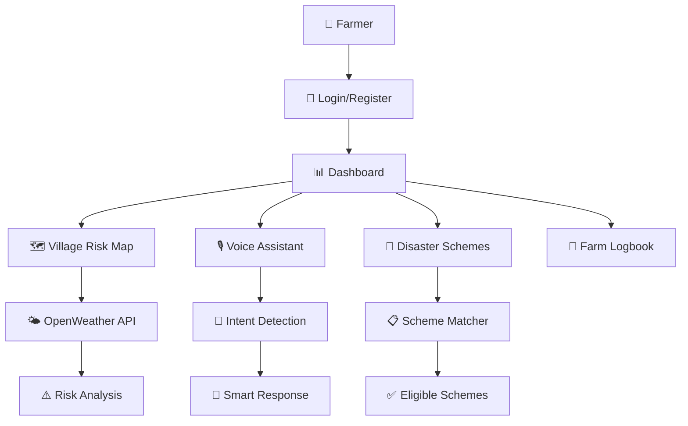
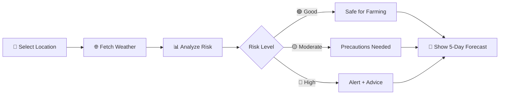
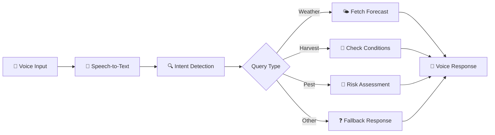

# 🌾 CropPilot – Smart Farmer Assistant

> **Empowering Indian farmers with AI-driven weather insights, voice assistance, and government scheme navigation — in their native language.**

---

## 📖 Overview

CropPilot is a multilingual decision-support platform designed for Indian farmers. It combines real-time weather analysis, voice-enabled assistance, and disaster relief scheme discovery into one simple interface. Our mission: make agricultural intelligence accessible to every farmer, regardless of language or technical skill.

---

## ✨ Key Features

| Feature | Description |
|---------|-------------|
| 🌍 **Multilingual Interface** | Supports Hindi, Kannada, Tamil, Telugu, Malayalam & English |
| 🗺️ **Village Risk Map** | Live weather-based risk assessment for any location |
| 🎙️ **Voice Assistant** | Speak your farming questions, get instant answers |
| 🚨 **Disaster Scheme Navigator** | Find eligible government relief schemes in seconds |
| 📍 **Smart Location Detection** | Auto-detect or click-to-select your farm location |
| 🌦️ **5-Day Forecast** | Daily farming do's and don'ts based on weather |

---

## 🎯 Problem It Solves

- **Language Barriers** — Most agri-tech tools are English-only
- **Weather Uncertainty** — Farmers lack localized, actionable forecasts
- **Scheme Awareness Gap** — Disaster relief schemes are hard to discover
- **Digital Divide** — Voice-first design for low-literacy users

---

## 🛠️ Tech Stack

| Layer | Technology |
|-------|------------|
| Backend | Flask (Python) |
| Database | SQLite |
| Frontend | HTML5, CSS3, JavaScript |
| Maps | Leaflet.js |
| Weather | OpenWeather API |
| Voice | Web Speech API |
| AI | Google Gemini (optional) |

---

## 🏗️ System Architecture



---

## 🗺️ Village Risk Map Flow



---

## 🎙️ Voice Assistant Flow



---

## 📸 Screenshots

| Village Risk Map | Voice Assistant | Disaster Schemes |
|------------------|-----------------|------------------|
|  |  |  |

---

## 🚀 Run Locally

```bash
# Clone the repository
git clone https://github.com/yourusername/croppilot.git
cd croppilot

# Install dependencies
pip install -r requirements.txt

# Set up environment variables (add OPENWEATHER_API_KEY)
cp .env.example .env

# Run the app
python app.py
```

Open `http://127.0.0.1:5000` in your browser.

---

## 🔮 Future Scope

- 📱 **SMS Alerts** — Weather warnings via text message
- 🤖 **AI Crop Intelligence** — Personalized crop recommendations
- 📴 **Offline Mode** — Core features without internet
- 🗃️ **Regional Datasets** — Mandi prices & local soil data

---

## 👨‍💻 Author

Built with ❤️ for **AgroTech Hackathon 2026**

---

<p align="center">
  <i>Making agriculture smarter, one farmer at a time.</i>
</p>
