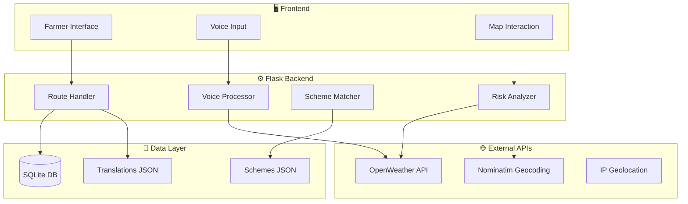
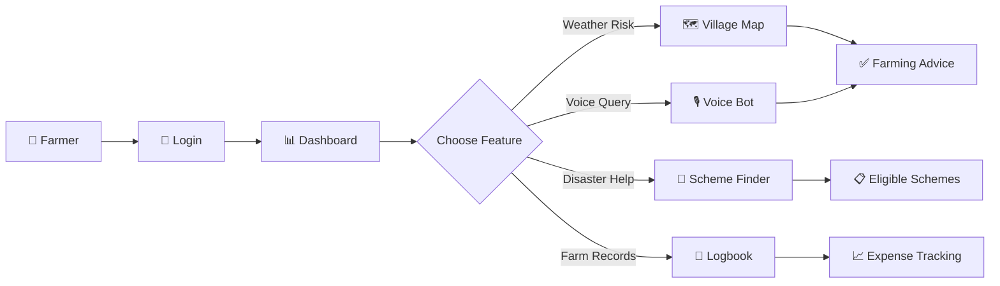
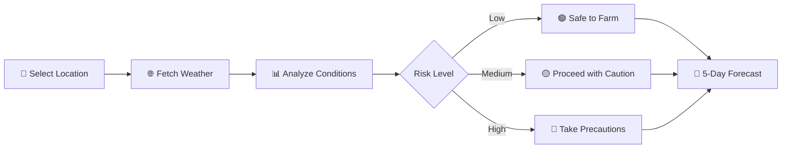
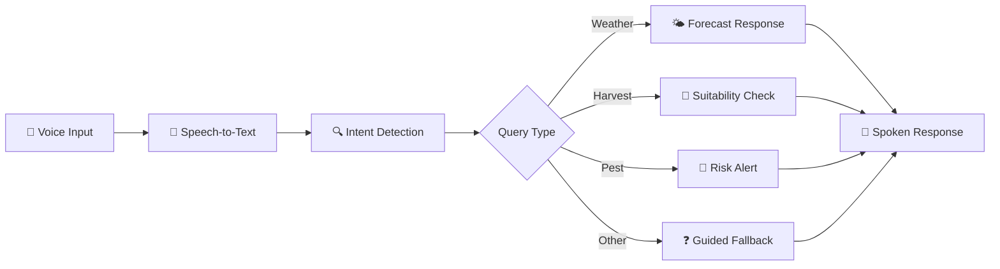
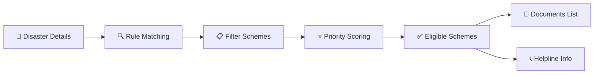
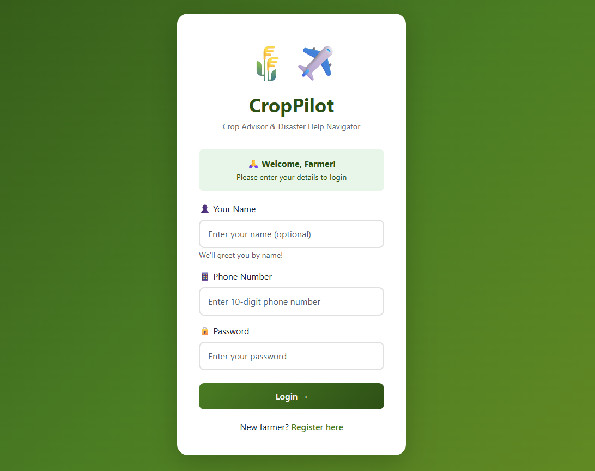
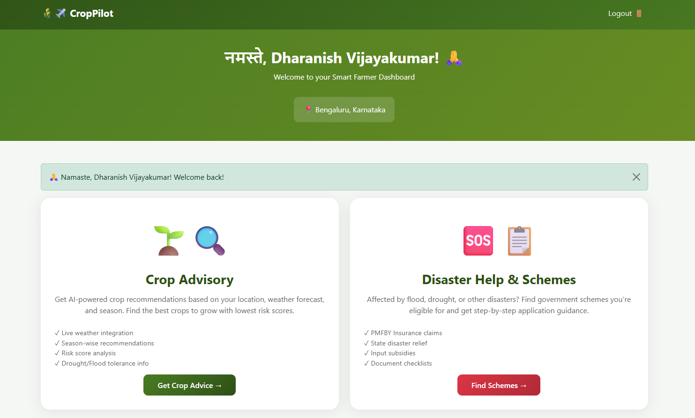
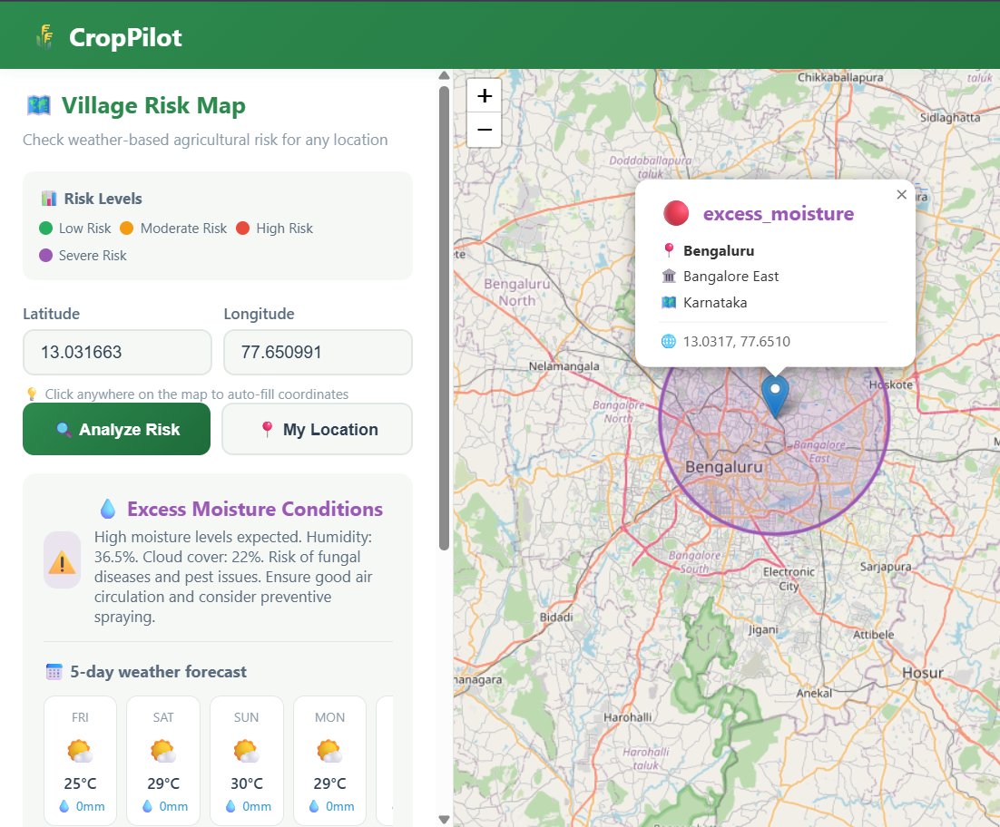
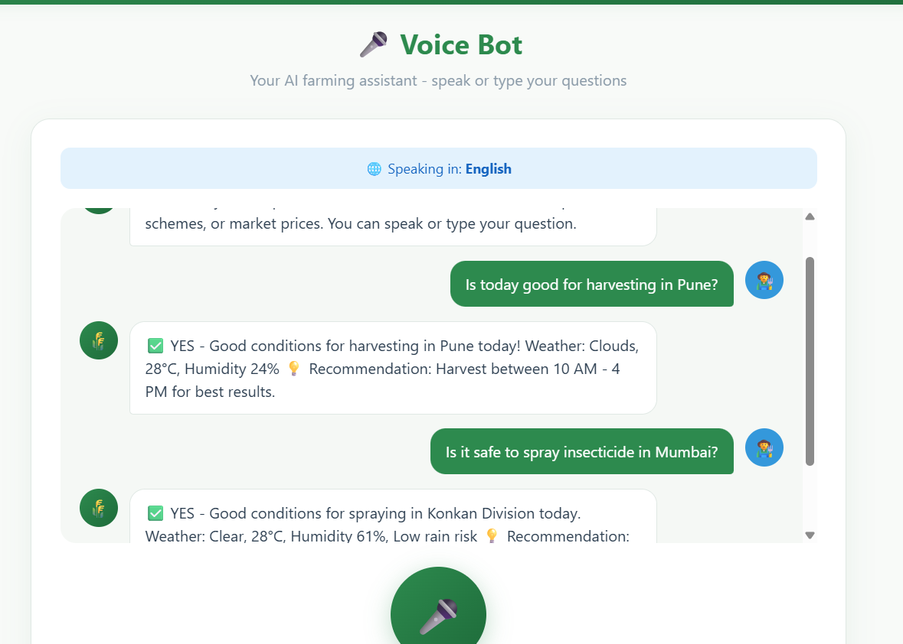
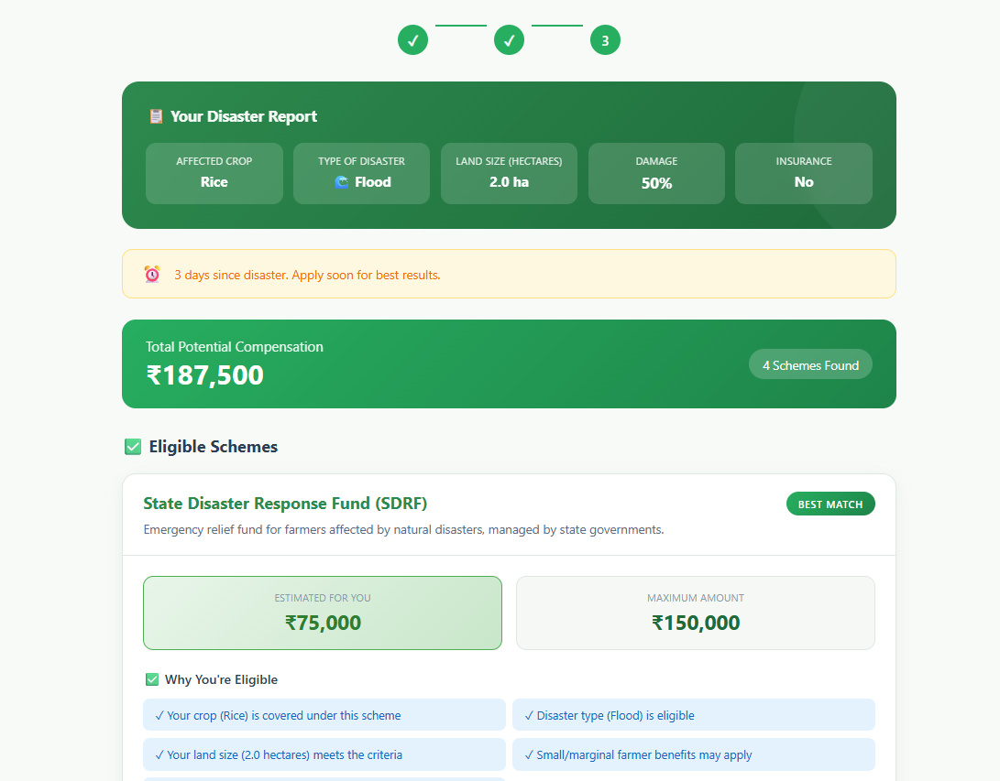

<div align="center">

# 🌾 CropPilot

### Smart Farmer Assistant

**Empowering 140 million Indian farming families with AI-driven weather intelligence, voice assistance, and government scheme navigation — in their native language.**

[](https://python.org)
[](https://flask.palletsprojects.com)
[](LICENSE)
[](/)

---

*"From weather warnings to welfare schemes — your complete farming companion."*

[🚀 Get Started](#%EF%B8%8F-installation) • [✨ Features](#-core-features) • [📸 Screenshots](#-screenshots) • [🤝 Contribute](#-contributing)

</div>

---

## 🌍 The Problem

> **Every year, Indian farmers lose ₹50,000+ crore to preventable crop damage.**

Imagine waking up at 4 AM, walking to your field, and discovering that last night's unexpected hailstorm destroyed your entire wheat harvest. You've heard there might be government relief — but the forms are in English, the process is confusing, and no one in your village knows which schemes apply to you.

This is the reality for millions of Indian farmers who face:

| Challenge | Impact |
|-----------|--------|
| 🗣️ **Language Barriers** | 90% of agri-tech tools are English-only |
| 🌪️ **Weather Uncertainty** | Generic city forecasts miss hyperlocal conditions |
| 📋 **Scheme Unawareness** | ₹10,000+ crore in relief funds go unclaimed annually |
| 📱 **Digital Divide** | Complex apps exclude low-literacy users |

**The gap isn't technology. It's accessibility.**

---

## 🚀 The Solution — CropPilot

**CropPilot is a multilingual, voice-enabled, weather-aware assistant built for Indian farmers.**

We didn't build another farming app. We built a *companion* — one that speaks your language, understands your land, and guides you through every decision.

<div align="center">

| What Makes Us Different |
|------------------------|
| 🗣️ **Speak, don't type** — Ask questions in Hindi or English |
| 🗺️ **Your village, not your city** — Hyperlocal weather risk analysis |
| 📋 **Know your rights** — Instant disaster scheme eligibility |
| 🌐 **6 languages** — Hindi, Kannada, Tamil, Telugu, Malayalam, English |

</div>

---

## ✨ Core Features

### 🌍 Multilingual Interface
> **One-click language switching across the entire platform**

Every button, label, and message is natively translated. Farmers interact in the language they think in — not the language developers code in.

---

### 🗺️ Village Risk Map
> **Real-time weather risk visualization for any location in India**

Click anywhere on the map or auto-detect your GPS coordinates. Get color-coded risk levels (🟢 Safe, 🟡 Caution, 🔴 Danger) with specific farming recommendations and a 5-day forecast.

---

### 🎙️ Voice Assistant
> **Hands-free farming guidance in Hindi and English**

Just tap and speak: *"Can I harvest wheat today in Pune?"* — and get instant, intelligent responses covering weather, harvesting, spraying, pest alerts, and more.

---

### 🚨 Disaster Scheme Navigator
> **Find government relief programs you're eligible for — in seconds**

Input your crop, disaster type, and land size. The system matches you against our database of central and state schemes, showing compensation amounts, required documents, and step-by-step application guides.

---

### 📍 Smart Location Detection
> **Works everywhere — GPS, IP, or manual selection**

Whether you're on HTTPS, HTTP, or a slow network — location detection adapts automatically. No farmer left behind.

---

### 🌦️ 5-Day Farming Forecast
> **Daily do's and don'ts based on real weather data**

Not just temperature — humidity, rainfall, cloud cover, and risk analysis combined into actionable advice: *"Avoid spraying today — rain expected."*

---

## 🧠 How It Works

CropPilot follows a simple philosophy: **Farmer asks → System understands → Actionable response.**



---

## 🔁 User Journey



---

## 🗺️ Feature Flows

### Village Risk Map


### Voice Assistant


### Scheme Navigator


---

## 📸 Screenshots

### 🔐 Login & Registration


Secure phone-based authentication with state/district selection and instant language switching. Designed for mobile-first access with minimal input required.

---

### 📊 Dashboard


The central hub showing quick access to all features, personalized greeting, and current weather summary. Clean, distraction-free interface optimized for low-bandwidth connections.

---

### 🗺️ Village Risk Map


Interactive Leaflet.js map with click-to-select or GPS auto-detection. Real-time weather data displayed alongside color-coded risk indicators and farming recommendations.

---

### 🎙️ Voice Assistant


Chat-style interface with speech recognition. Ask questions naturally in Hindi or English and receive formatted responses with actionable advice.

---

### 🚨 Disaster Scheme Navigator


Complete scheme information including eligibility reasons, maximum compensation, document checklists with progress tracking, and direct helpline numbers.

---

## 🛠️ Tech Stack

| Layer | Technology | Purpose |
|-------|------------|---------|
| **Backend** | Flask (Python) | Lightweight, fast API routing |
| **Database** | SQLite | Zero-config, portable storage |
| **Frontend** | HTML5, CSS3, JS | Responsive, mobile-first UI |
| **Maps** | Leaflet.js | Interactive map visualization |
| **Weather** | OpenWeather API | Real-time forecast data |
| **Geocoding** | Nominatim | Reverse location lookup |
| **Voice** | Web Speech API | Browser-native speech recognition |
| **AI** | Google Gemini | Optional intelligent responses |

---

## 🧩 Architecture Philosophy

We made deliberate choices to serve farmers, not impress developers:

| Principle | Implementation |
|-----------|----------------|
| **Lightweight** | No heavy frameworks — Flask + vanilla JS |
| **Farmer-First UX** | Large buttons, voice input, minimal text |
| **Low Bandwidth** | Compressed assets, lazy loading, cached data |
| **Offline-Ready** | Core features designed for future PWA conversion |
| **Simple Deploy** | Single `python app.py` — no Docker required |

---

## ⚙️ Installation

```bash
# Clone the repository
git clone https://github.com/yourusername/croppilot.git
cd croppilot

# Create virtual environment (recommended)
python -m venv venv
source venv/bin/activate  # On Windows: venv\Scripts\activate

# Install dependencies
pip install -r requirements.txt

# Configure environment
cp .env.example .env
# Add your OPENWEATHER_API_KEY to .env

# Run the application
python app.py
```

Open `http://127.0.0.1:5000` in your browser.

---

## 🌱 Real-World Impact

<div align="center">

| Metric | Impact |
|--------|--------|
| 🗣️ **6 Languages** | Reaches 95% of Indian farmers |
| 🌧️ **Hyperlocal Forecasts** | Reduces weather-related losses |
| 📋 **Scheme Discovery** | Unlocks unclaimed relief funds |
| 🎙️ **Voice Interface** | Includes low-literacy users |
| 📱 **Mobile-First** | Works on ₹5,000 smartphones |

</div>

**CropPilot doesn't just provide information — it provides confidence.**

When a farmer knows the weather, knows their rights, and can access guidance in their own language, they make better decisions. Better decisions mean healthier crops, stable incomes, and stronger communities.

---

## 🔮 Future Roadmap

| Phase | Feature | Status |
|-------|---------|--------|
| **v1.1** | SMS Weather Alerts | 🔜 Planned |
| **v1.2** | Offline Mode (PWA) | 🔜 Planned |
| **v2.0** | AI Crop Disease Detection | 🔬 Research |
| **v2.1** | Satellite NDVI Integration | 🔬 Research |
| **v3.0** | Government API Integration | 🎯 Long-term |
| **v3.1** | Mandi Price Predictions | 🎯 Long-term |

---

## 🤝 Contributing

We welcome contributions from developers, designers, translators, and domain experts!

```bash
# Fork the repo
# Create your feature branch
git checkout -b feature/amazing-feature

# Commit your changes
git commit -m 'Add amazing feature'

# Push to the branch
git push origin feature/amazing-feature

# Open a Pull Request
```

**Areas we need help:**
- 🌐 Additional language translations
- 🧪 Testing on low-end devices
- 📊 Regional crop/scheme data
- 🎨 UI/UX improvements

---

## 🏆 Hackathon Note

> This project was built for **AgroTech Hackathon 2026** with a singular focus: **impact over complexity.**

We didn't chase blockchain, AR, or buzzwords. We built what farmers actually need — accessible, understandable, actionable guidance.

Every line of code was written with one question: *"Will this help a farmer in Vidarbha make a better decision tomorrow?"*

---

## 👥 Team

| Name | Role |
|------|------|
| **[Your Name]** | Team Lead & Backend |
| **[Teammate 2]** | Frontend Development |
| **[Teammate 3]** | UI/UX Design |
| **[Teammate 4]** | Research & Testing |

---

## 👨‍💻 Author

<div align="center">

Built with ❤️ for farmers and the future of agri-tech.

*Making agriculture smarter, one village at a time.*

---

**[⬆ Back to Top](#-croppilot)**

</div>
