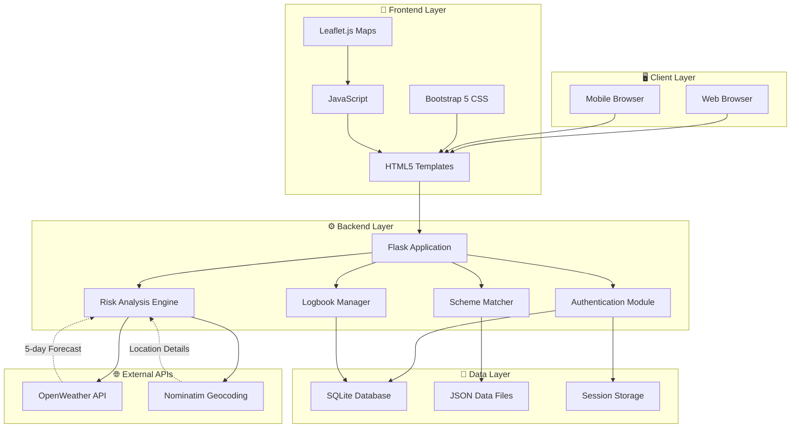
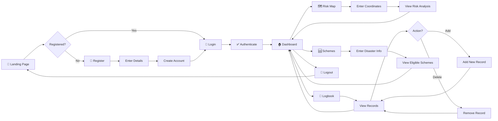
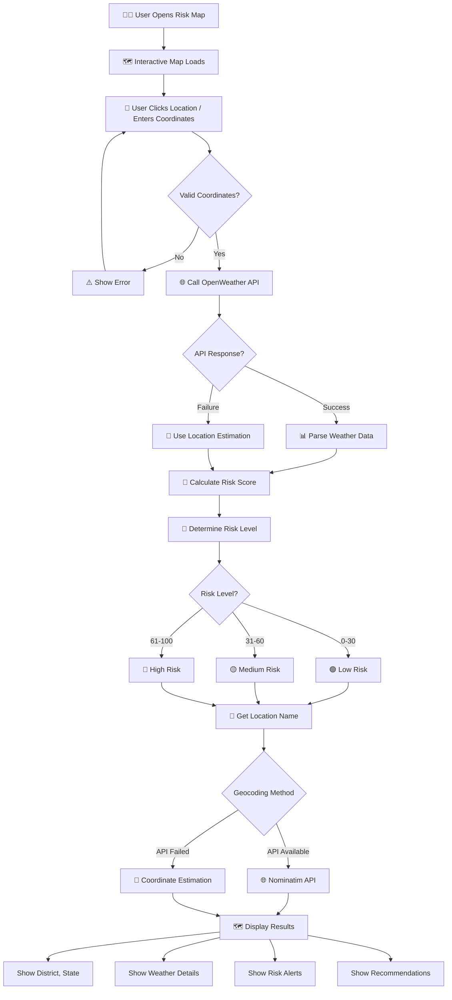
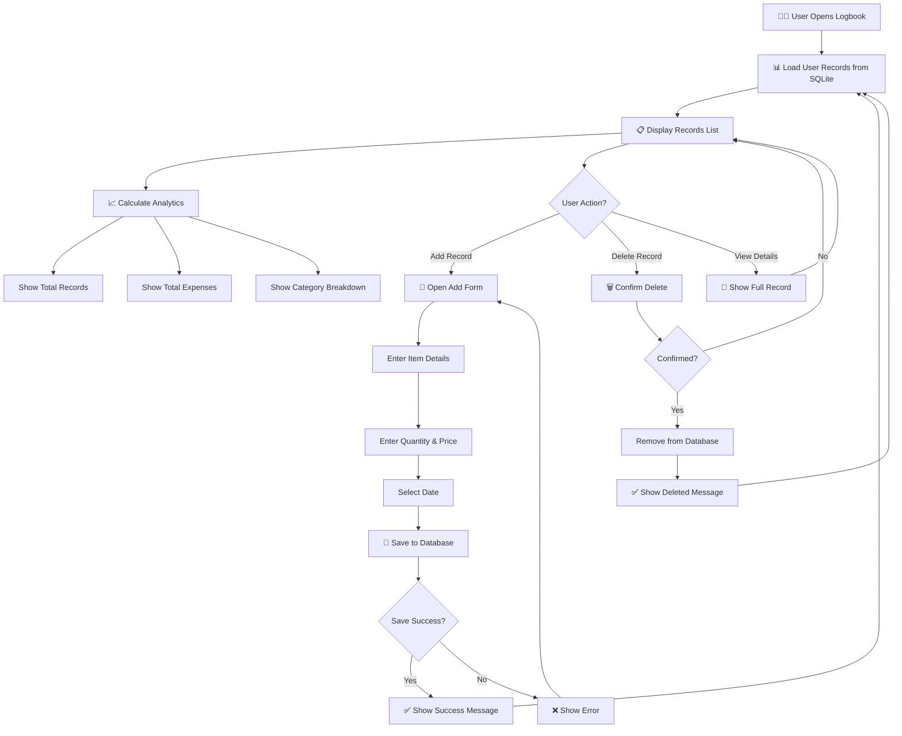
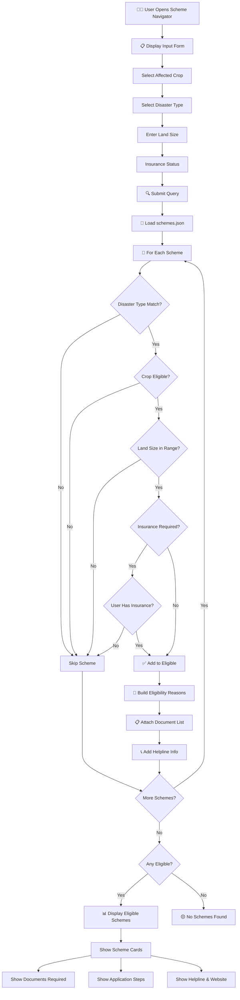
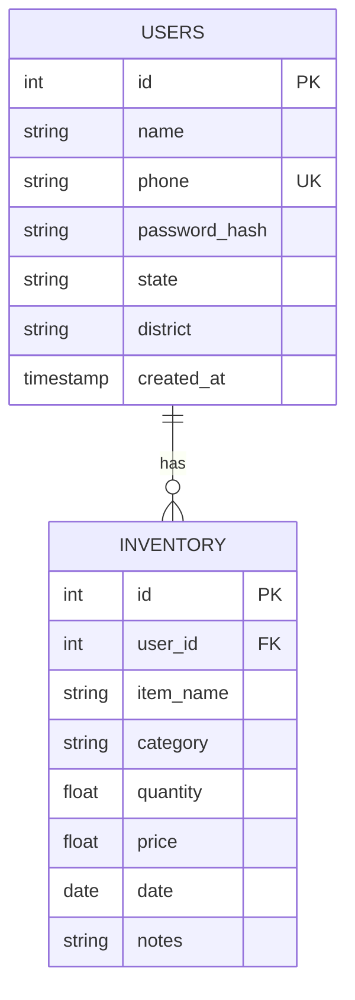

<div align="center">

# 🌾✈️ CropPilot

### Smart Farmer Decision Support System

**Empowering Indian Farmers with Weather Intelligence, Farm Management & Disaster Relief Navigation**

[](https://python.org)
[](https://flask.palletsprojects.com)
[](https://sqlite.org)
[](https://getbootstrap.com)
[](https://leafletjs.com)

---

*"From Weather Warnings to Welfare Schemes — Your Complete Farming Companion"*

[🚀 Get Started](#-installation--setup) • [📖 Documentation](#-how-each-module-works) • [🎯 Features](#-key-features) • [🤝 Contribute](#-contributing)

</div>

---

## 📋 Table of Contents

- [Problem Statement](#-problem-statement)
- [Our Solution](#-our-solution)
- [Key Features](#-key-features)
- [System Architecture](#-system-architecture)
- [User Flow](#-user-flow)
- [Module Flowcharts](#-module-flowcharts)
- [Folder Structure](#-folder-structure)
- [Technologies Used](#-technologies-used)
- [How Each Module Works](#-how-each-module-works)
- [Database Structure](#-database-structure)
- [Screens & UI](#-screens--ui-explanation)
- [Real World Benefits](#-real-world-benefits)
- [Future Scope](#-future-scope)
- [Installation & Setup](#-installation--setup)
- [API Configuration](#-api-configuration)
- [Team & Credits](#-team--credits)
- [License](#-license)

---

## 🎯 Problem Statement

> **140 million farming families in India face these critical challenges daily:**

| Challenge | Impact | Current Reality |
|-----------|--------|-----------------|
| 🌪️ **Unpredictable Weather** | Crop losses worth ₹50,000+ crore annually | Farmers rely on guesswork and outdated methods |
| 📊 **No Farm Records** | Cannot track expenses, yields, or patterns | Paper-based or no record keeping |
| 🆘 **Disaster Relief Gap** | ₹10,000+ crore in unclaimed relief funds | Complex schemes, unknown eligibility |
| 📍 **Location-Specific Risks** | Same district, different micro-climates | Generic weather forecasts don't help |

### The Human Cost

```
❌ Farmer checks weather → Generic city forecast → Misses local hailstorm warning
❌ Disaster strikes → Doesn't know eligible schemes → Misses application deadline  
❌ Season ends → No records of expenses → Cannot calculate profit/loss
❌ Bank loan needed → No documented farm history → Loan rejected
```

---

## 💡 Our Solution

**CropPilot** is an integrated farmer decision-support system that brings together:

<div align="center">

| Module | What It Does | Farmer Benefit |
|--------|--------------|----------------|
| 🗺️ **Village Risk Map** | Real-time weather risk visualization | Know dangers before they arrive |
| 📒 **Farm Logbook** | Digital record of all farm activities | Track everything, miss nothing |
| 🆘 **Scheme Navigator** | Instant disaster relief eligibility | Claim what you deserve |
| 🔐 **Secure Login** | Personal data protection | Your farm, your data |

</div>

### The CropPilot Difference

```
✅ Farmer opens CropPilot → Sees village-level risk map → Protects crops in advance
✅ Disaster strikes → Instantly finds eligible schemes → Applies with document checklist
✅ Season ends → Complete digital logbook → Clear profit/loss analysis
✅ Bank loan needed → Shows verified farm history → Loan approved
```

---

## ✨ Key Features

### 🔐 1. Farmer Authentication System

<table>
<tr>
<td width="60%">

**Secure & Simple Login**

- 📱 Phone number-based registration
- 🔒 Password hashing with Werkzeug
- 📍 State & District capture for localization
- 🎫 Session-based authentication
- 👤 Personalized dashboard greeting

</td>
<td width="40%">

```
┌─────────────────────┐
│   🌾✈️ CropPilot    │
│                     │
│  📱 Phone: xxxxxxxx │
│  🔒 Password: ••••• │
│                     │
│  [    Login →    ]  │
│                     │
│  New? Register here │
└─────────────────────┘
```

</td>
</tr>
</table>

---

### 🗺️ 2. Village Risk Map

<table>
<tr>
<td width="60%">

**Hyperlocal Weather Intelligence**

- 🌡️ Real-time temperature monitoring
- 🌧️ Rainfall prediction & flood alerts
- 💨 Wind speed analysis for crop safety
- 🎨 Color-coded risk visualization
- 📍 Click-anywhere coordinate input
- 📊 5-day forecast breakdown

**Risk Levels:**
- 🟢 **Low (0-30)**: Safe conditions
- 🟡 **Medium (31-60)**: Monitor closely
- 🔴 **High (61-100)**: Take action

</td>
<td width="40%">

```
    🗺️ VILLAGE RISK MAP
    
    ┌─────────────────┐
    │ 📍 Your Village │
    │    ┌─────┐      │
    │    │ 🔴  │ HIGH │
    │    └─────┘      │
    │                 │
    │ Risk Score: 78  │
    │ ⚠️ Flood Alert  │
    └─────────────────┘
    
    Temp: 32°C | Rain: 85mm
    Wind: 45 km/h | Humidity: 89%
```

</td>
</tr>
</table>

---

### 📒 3. Farm Logbook (Inventory Management)

<table>
<tr>
<td width="60%">

**Your Digital Farm Diary**

- 📝 Record crops, inputs, expenses
- 📅 Date-wise activity logging
- 💰 Expense tracking & analytics
- 📊 Visual spending breakdown
- 📈 Historical pattern analysis
- 🗑️ Easy record management

**Track Everything:**
- Seeds purchased
- Fertilizers used
- Labor costs
- Equipment expenses
- Harvest records

</td>
<td width="40%">

```
📒 FARM LOGBOOK

┌────────────────────────┐
│ Total Records: 24      │
│ Total Spent: ₹45,600   │
├────────────────────────┤
│ 📅 15 Jan - Seeds      │
│    Wheat - ₹2,400      │
│                        │
│ 📅 20 Jan - Fertilizer │
│    DAP - ₹3,200        │
│                        │
│ 📅 25 Jan - Labor      │
│    Sowing - ₹1,800     │
└────────────────────────┘

[+ Add New Record]
```

</td>
</tr>
</table>

---

### 🆘 4. Disaster Scheme Navigator

<table>
<tr>
<td width="60%">

**Your Relief Fund Guide**

- 🌊 Multi-disaster coverage (Flood, Drought, Cyclone, Hailstorm, Pest Attack)
- ✅ Instant eligibility checking
- 📋 Complete document checklist
- 📝 Step-by-step application guide
- 📞 Direct helpline numbers
- 🌐 Official website links

**Schemes Covered:**
- PM Fasal Bima Yojana
- State Disaster Relief Fund
- Kisan Credit Card Relief
- Input Subsidy Scheme
- And more...

</td>
<td width="40%">

```
🆘 SCHEME NAVIGATOR

Your Situation:
┌────────────────────────┐
│ Crop: Wheat            │
│ Disaster: Flood        │
│ Land: 2 hectares       │
│ Insurance: Yes ✓       │
└────────────────────────┘

✅ Eligible Schemes: 3

┌────────────────────────┐
│ 1. PMFBY               │
│    💰 Up to ₹2,00,000  │
│    📋 Documents: 5     │
│    [View Details →]    │
└────────────────────────┘
```

</td>
</tr>
</table>

---

## 🏗️ System Architecture



---

## 🔄 User Flow



---

## 📊 Module Flowcharts

### 🗺️ Village Risk Map Flow



---

### 📒 Farm Logbook Flow



---

### 🆘 Scheme Navigator Flow



---

## 📁 Folder Structure

```
crop_advisor/
│
├── 📄 app.py                     # Main Flask application
├── 📄 model.py                   # ML risk prediction model
├── 📄 init_db.py                 # Database initialization
│
├── 📂 templates/                 # HTML Templates
│   ├── 📄 login.html             # User login page
│   ├── 📄 register.html          # New user registration
│   ├── 📄 dashboard.html         # Main dashboard
│   ├── 📄 risk_map.html          # Village risk map
│   ├── 📄 inventory.html         # Farm logbook
│   ├── 📄 crop_form.html         # Crop advisory input
│   ├── 📄 crop_result.html       # Crop recommendations
│   ├── 📄 disaster_form.html     # Disaster help input
│   └── 📄 disaster_result.html   # Eligible schemes
│
├── 📂 static/                    # Static assets
│   ├── 📂 css/                   # Custom stylesheets
│   ├── 📂 js/                    # JavaScript files
│   └── 📂 images/                # Images & icons
│
├── 📂 data/                      # Data files
│   ├── 📄 crops.csv              # Crop database
│   ├── 📄 crop_data.json         # Extended crop info
│   └── 📄 schemes.json           # Government schemes
│
├── 📄 croppilot.db               # SQLite database (auto-generated)
├── 📄 model.pkl                  # Trained ML model (auto-generated)
├── 📄 .env                       # Environment variables
├── 📄 requirements.txt           # Python dependencies
└── 📄 README.md                  # Project documentation
```

---

## 🛠️ Technologies Used

| Category | Technology | Purpose |
|----------|------------|---------|
| **Backend Framework** |  | Web application & API routing |
| **Database** |  | User data & logbook storage |
| **Frontend** |  | Page structure |
| **Styling** |  | Responsive UI components |
| **Maps** |  | Interactive map visualization |
| **Weather API** |  | Real-time weather data |
| **Geocoding** |  | Reverse geocoding |
| **Authentication** |  | Password hashing & security |
| **ML Model** |  | Risk prediction |
| **Data Format** |  | Scheme & crop data |

---

## 📖 How Each Module Works

### 🔐 Authentication Module

```python
# Registration Flow
1. User enters: Name, Phone (10-digit), State, District, Password
2. Validation: Phone format, password strength (min 6 chars)
3. Security: Password hashed using werkzeug.generate_password_hash()
4. Storage: User record created in SQLite users table
5. Session: Auto-login after registration

# Login Flow
1. User enters: Phone number, Password
2. Lookup: Find user by phone in database
3. Verify: Compare hash using check_password_hash()
4. Session: Store user_id, name, state, district in session
5. Redirect: Navigate to personalized dashboard
```

---

### 🗺️ Risk Map Module

```python
# Risk Calculation Algorithm
def analyze_village_risk(lat, lon):
    # Step 1: Fetch weather data
    weather = get_weather_forecast(lat, lon)  # OpenWeather API
    
    # Step 2: Get location details
    location = get_location_details(lat, lon)  # Nominatim API
    
    # Step 3: Calculate component risks
    temp_risk = calculate_temp_risk(weather['temp'])      # 0-100
    rain_risk = calculate_rain_risk(weather['rainfall'])  # 0-100
    wind_risk = calculate_wind_risk(weather['wind'])      # 0-100
    
    # Step 4: Weighted average
    overall_risk = (temp_risk * 0.3) + (rain_risk * 0.5) + (wind_risk * 0.2)
    
    # Step 5: Determine level
    if overall_risk <= 30: level = "LOW"
    elif overall_risk <= 60: level = "MEDIUM"
    else: level = "HIGH"
    
    return {risk_score, level, alerts, recommendations}
```

---

### 📒 Logbook Module

```python
# Database Operations
def add_inventory_record(user_id, item, category, quantity, price, date):
    conn = get_db_connection()
    conn.execute('''
        INSERT INTO inventory (user_id, item_name, category, quantity, price, date)
        VALUES (?, ?, ?, ?, ?, ?)
    ''', (user_id, item, category, quantity, price, date))
    conn.commit()
    
# Analytics Calculation
def get_user_analytics(user_id):
    records = get_all_records(user_id)
    return {
        'total_records': len(records),
        'total_spent': sum(r['price'] * r['quantity'] for r in records),
        'by_category': group_by_category(records),
        'monthly_trend': calculate_monthly_trend(records)
    }
```

---

### 🆘 Scheme Navigator Module

```python
# Eligibility Matching Logic
def find_eligible_schemes(crop, disaster_type, land_size, has_insurance):
    schemes = load_schemes_json()
    eligible = []
    
    for scheme in schemes:
        # Rule 1: Disaster type must match
        if disaster_type not in scheme['disaster_types']:
            continue
            
        # Rule 2: Crop must be covered
        if crop not in scheme['eligible_crops']:
            continue
            
        # Rule 3: Land size must be in range
        if not (scheme['min_land'] <= land_size <= scheme['max_land']):
            continue
            
        # Rule 4: Insurance requirement
        if scheme['requires_insurance'] and not has_insurance:
            continue
        
        # All rules passed - scheme is eligible
        eligible.append(scheme)
    
    return eligible
```

---

## 💾 Database Structure

### Users Table

| Column | Type | Description |
|--------|------|-------------|
| `id` | INTEGER | Primary key, auto-increment |
| `name` | TEXT | Farmer's full name |
| `phone` | TEXT | 10-digit phone (unique) |
| `password_hash` | TEXT | Werkzeug hashed password |
| `state` | TEXT | State of residence |
| `district` | TEXT | District of residence |
| `created_at` | TIMESTAMP | Registration date |

### Inventory Table

| Column | Type | Description |
|--------|------|-------------|
| `id` | INTEGER | Primary key, auto-increment |
| `user_id` | INTEGER | Foreign key to users |
| `item_name` | TEXT | Name of item/activity |
| `category` | TEXT | Category (Seeds, Fertilizer, etc.) |
| `quantity` | REAL | Quantity with unit |
| `price` | REAL | Price in INR |
| `date` | DATE | Date of record |
| `notes` | TEXT | Optional notes |

### Entity Relationship Diagram



---

## 🖼️ Screens & UI Explanation

### Screen Flow Diagram

```
┌─────────────────────────────────────────────────────────────────┐
│                        🌾✈️ CropPilot                            │
├─────────────────────────────────────────────────────────────────┤
│                                                                 │
│  ┌─────────────┐    ┌─────────────┐    ┌─────────────┐         │
│  │   LOGIN     │───▶│  REGISTER   │───▶│  DASHBOARD  │         │
│  │   Screen    │    │   Screen    │    │   Screen    │         │
│  └─────────────┘    └─────────────┘    └──────┬──────┘         │
│                                               │                 │
│         ┌─────────────────┬─────────────────┬─┘                │
│         ▼                 ▼                 ▼                   │
│  ┌─────────────┐   ┌─────────────┐   ┌─────────────┐           │
│  │  RISK MAP   │   │  LOGBOOK    │   │  SCHEMES    │           │
│  │   Screen    │   │   Screen    │   │   Screen    │           │
│  └──────┬──────┘   └──────┬──────┘   └──────┬──────┘           │
│         ▼                 ▼                 ▼                   │
│  ┌─────────────┐   ┌─────────────┐   ┌─────────────┐           │
│  │ RISK RESULT │   │ ADD RECORD  │   │  ELIGIBLE   │           │
│  │   Screen    │   │   Modal     │   │   SCHEMES   │           │
│  └─────────────┘   └─────────────┘   └─────────────┘           │
│                                                                 │
└─────────────────────────────────────────────────────────────────┘
```

### UI Components

| Screen | Key Components | User Actions |
|--------|---------------|--------------|
| **Login** | Phone input, Password input, Submit button | Enter credentials, Login |
| **Register** | Name, Phone, State dropdown, District input, Password | Fill form, Register |
| **Dashboard** | Welcome card, 3 feature cards, Quick stats | Navigate to modules |
| **Risk Map** | Leaflet map, Coordinate inputs, Results panel | Click map, View risk |
| **Logbook** | Records table, Add button, Analytics cards | Add/Delete records |
| **Schemes** | Crop dropdown, Disaster dropdown, Land input | Submit, View schemes |

---

## 🌟 Real World Benefits

### For Individual Farmers

| Benefit | Without CropPilot | With CropPilot |
|---------|-------------------|----------------|
| **Weather Awareness** | Check generic city forecast | Village-level risk alerts |
| **Record Keeping** | Paper notes, often lost | Digital, searchable, permanent |
| **Scheme Discovery** | Visit multiple offices | Instant eligibility check |
| **Document Preparation** | Guess what's needed | Complete checklist provided |
| **Time Saved** | Days of office visits | Minutes on phone |

### For Farming Community

```
📈 Increased scheme uptake → More relief reaches farmers
📊 Digital records → Easier loan approvals  
🎯 Targeted warnings → Reduced crop losses
💰 Better planning → Improved profitability
📱 Mobile access → Information in the field
```

### Economic Impact Potential

| Metric | Potential Impact |
|--------|------------------|
| **Crop Loss Reduction** | 15-20% with early warnings |
| **Scheme Claim Rate** | Increase from 30% to 70%+ |
| **Time Savings** | 10+ hours per disaster event |
| **Loan Approval Rate** | 2x with documented history |

---

## 🚀 Future Scope

### Phase 2: Enhanced Features

| Feature | Description | Impact |
|---------|-------------|--------|
| 🌐 **Multilingual Support** | Hindi, Tamil, Telugu, Marathi | 10x user reach |
| 📱 **SMS Alerts** | Weather warnings via SMS | Reach non-smartphone users |
| 🎤 **Voice Input** | Speak coordinates in local language | Easier for elderly farmers |
| 📷 **Crop Doctor** | Image-based disease detection | Early pest/disease control |

### Phase 3: Advanced Intelligence

| Feature | Description | Impact |
|---------|-------------|--------|
| 🤖 **AI Yield Prediction** | ML-based harvest estimation | Better market planning |
| 📊 **Price Forecasting** | Mandi price predictions | Optimal selling time |
| 🌍 **Satellite Integration** | ISRO data for soil health | Precision farming |
| 🔗 **Government API** | Direct scheme application | One-click relief claims |

### Phase 4: Ecosystem

| Feature | Description | Impact |
|---------|-------------|--------|
| 👥 **Farmer Network** | Community features, chat | Peer learning |
| 🏪 **Marketplace** | Buy/sell inputs & produce | Better prices |
| 🏦 **Loan Integration** | Bank partnerships | Easier credit access |
| 📡 **IoT Sensors** | Field monitoring devices | Real-time farm data |

---

## 🚀 Installation & Setup

### Prerequisites

- Python 3.8 or higher
- pip (Python package manager)
- Git (optional)
- Internet connection (for weather API)

### Step-by-Step Installation

```bash
# Step 1: Clone the repository
git clone https://github.com/yourusername/croppilot.git
cd croppilot

# Step 2: Create virtual environment
python -m venv venv

# Step 3: Activate virtual environment
# Windows:
venv\Scripts\activate
# Linux/Mac:
source venv/bin/activate

# Step 4: Install dependencies
pip install -r requirements.txt

# Step 5: Create environment file
# Create .env file with:
echo "SECRET_KEY=your-super-secret-key-here" > .env
echo "OPENWEATHER_API_KEY=your-api-key-here" >> .env

# Step 6: Initialize database
python init_db.py

# Step 7: Run the application
python app.py

# Step 8: Open in browser
# Navigate to: http://127.0.0.1:5000
```

### Dependencies (requirements.txt)

```txt
flask>=2.0.0
pandas>=1.3.0
scikit-learn>=0.24.0
requests>=2.26.0
python-dotenv>=0.19.0
werkzeug>=2.0.0
```

---

## 🔑 API Configuration

### OpenWeather API Setup

1. **Create Account**
   - Visit [openweathermap.org](https://openweathermap.org/api)
   - Sign up for free account

2. **Get API Key**
   - Navigate to "API Keys" section
   - Copy your API key

3. **Configure CropPilot**
   ```env
   # .env file
   OPENWEATHER_API_KEY=a1b2c3d4e5f6g7h8i9j0k1l2m3n4o5p6
   ```

4. **Wait for Activation**
   - New keys take 10-15 minutes to activate

5. **Verify Configuration**
   - After login, visit: `/api-status`
   - Should show: `"api_working": true`

### Fallback Mode

> **No API key?** CropPilot still works! Weather is estimated based on:
> - Latitude (determines temperature range)
> - Current month (determines season)
> - Longitude (determines coastal proximity)

---

## 👥 Team & Credits

<div align="center">

### Built with ❤️ for Indian Farmers

| Role | Contribution |
|------|--------------|
| **Backend Development** | Flask app, API integration, Database design |
| **Frontend Development** | UI/UX design, Responsive templates |
| **Data Engineering** | Scheme data collection, Crop database |
| **ML Engineering** | Risk prediction model |

### Acknowledgments

- 🌤️ [OpenWeather](https://openweathermap.org/) for weather API
- 🗺️ [OpenStreetMap](https://www.openstreetmap.org/) for geocoding
- 🗺️ [Leaflet.js](https://leafletjs.com/) for map visualization
- 🎨 [Bootstrap](https://getbootstrap.com/) for UI components
- 🇮🇳 Government of India for scheme information

</div>

---

## 📄 License

```
MIT License

Copyright (c) 2024 CropPilot

Permission is hereby granted, free of charge, to any person obtaining a copy
of this software and associated documentation files (the "Software"), to deal
in the Software without restriction, including without limitation the rights
to use, copy, modify, merge, publish, distribute, sublicense, and/or sell
copies of the Software, and to permit persons to whom the Software is
furnished to do so, subject to the following conditions:

The above copyright notice and this permission notice shall be included in all
copies or substantial portions of the Software.

THE SOFTWARE IS PROVIDED "AS IS", WITHOUT WARRANTY OF ANY KIND, EXPRESS OR
IMPLIED, INCLUDING BUT NOT LIMITED TO THE WARRANTIES OF MERCHANTABILITY,
FITNESS FOR A PARTICULAR PURPOSE AND NONINFRINGEMENT. IN NO EVENT SHALL THE
AUTHORS OR COPYRIGHT HOLDERS BE LIABLE FOR ANY CLAIM, DAMAGES OR OTHER
LIABILITY, WHETHER IN AN ACTION OF CONTRACT, TORT OR OTHERWISE, ARISING FROM,
OUT OF OR IN CONNECTION WITH THE SOFTWARE OR THE USE OR OTHER DEALINGS IN THE
SOFTWARE.
```

---

<div align="center">

## 🌾 CropPilot

**Empowering Farmers, One Decision at a Time**

---

*If this project helped you, please ⭐ star the repository!*

[🔝 Back to Top](#-croppilot)

</div>