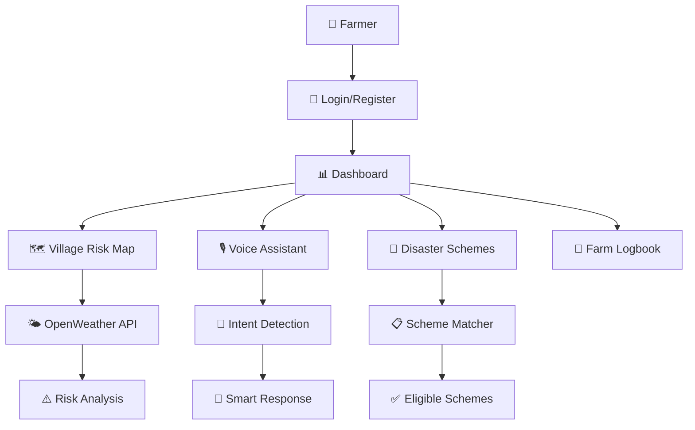
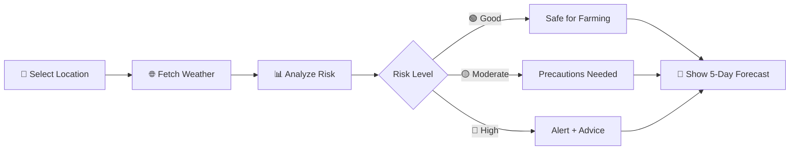
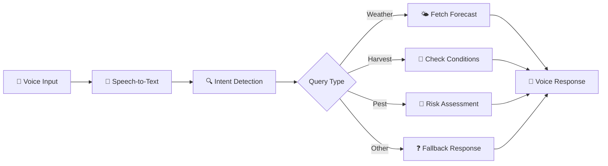

# 🌾 CropPilot – Smart Farmer Assistant

> **Empowering Indian farmers with AI-driven weather insights, voice assistance, and government scheme navigation — in their native language.**

---

## 👥 Team

| Name | Role |
|------|------|
| **[Your Name]** | Team Lead |
| **[Teammate 2]** | Backend Developer |
| **[Teammate 3]** | Frontend Developer |
| **[Teammate 4]** | UI/UX Designer |

---

## 📖 Overview

CropPilot is a multilingual decision-support platform designed for Indian farmers. It combines real-time weather analysis, voice-enabled assistance, and disaster relief scheme discovery into one simple interface. Our mission: make agricultural intelligence accessible to every farmer, regardless of language or technical skill.

---

## 🌍 Multilingual Support

CropPilot breaks language barriers by offering a fully translated interface in **6 Indian languages**:

| Language | Coverage |
|----------|----------|
| 🇬🇧 English | Full UI + Voice |
| 🇮🇳 Hindi (हिंदी) | Full UI + Voice |
| 🇮🇳 Kannada (ಕನ್ನಡ) | Full UI |
| 🇮🇳 Tamil (தமிழ்) | Full UI |
| 🇮🇳 Telugu (తెలుగు) | Full UI |
| 🇮🇳 Malayalam (മലയാളം) | Full UI |

**Key Multilingual Features:**
- 🔄 One-click language switching from any page
- 🎙️ Voice assistant understands Hindi and English queries
- 📝 All labels, buttons, messages translated natively
- 🌾 Crop names and farming terms in local languages
- 📋 Government scheme information in regional languages

---

## ✨ Key Features

| Feature | Description |
|---------|-------------|
| 🌍 **Multilingual Interface** | Supports Hindi, Kannada, Tamil, Telugu, Malayalam & English |
| 🗺️ **Village Risk Map** | Live weather-based risk assessment for any location |
| 🎙️ **Voice Assistant** | Speak your farming questions, get instant answers |
| 🚨 **Disaster Scheme Navigator** | Find eligible government relief schemes in seconds |
| 📍 **Smart Location Detection** | Auto-detect or click-to-select your farm location |
| 🌦️ **5-Day Forecast** | Daily farming do's and don'ts based on weather |

---

## 🛠️ Tech Stack

| Layer | Technology |
|-------|------------|
| Backend | Flask (Python) |
| Database | SQLite |
| Frontend | HTML5, CSS3, JavaScript |
| Maps | Leaflet.js |
| Weather | OpenWeather API |
| Voice | Web Speech API |
| AI | Google Gemini (optional) |

---

## 🏗️ System Architecture



---

## 🗺️ Village Risk Map Flow



---

## 🎙️ Voice Assistant Flow



---

## 📸 Screenshots

### 🔐 Login Page


The login page provides secure phone-based authentication designed specifically for Indian farmers. Users can register with their 10-digit mobile number, select their state and district for localized content, and choose their preferred language from the dropdown. The clean, mobile-friendly interface ensures easy access even on low-end smartphones. New users can quickly register while returning farmers simply enter their credentials to access their personalized dashboard.

---

### 🗺️ Village Risk Map


The interactive Village Risk Map is the heart of CropPilot's weather intelligence system. Farmers can click anywhere on the map or use the "My Location" button to auto-detect their coordinates. The system fetches real-time weather data from OpenWeather API and analyzes multiple parameters including temperature, humidity, rainfall forecast, and cloud cover. Risk levels are color-coded (Green = Safe, Yellow = Caution, Red = High Risk) with specific farming recommendations. The 5-day forecast helps farmers plan sowing, harvesting, and pesticide spraying activities. Location details show village, district, and state information for precise hyperlocal analysis.

---

### 🎙️ Voice Assistant


The Voice Assistant enables hands-free interaction for farmers who may have limited literacy or prefer speaking over typing. Simply tap the microphone button and ask questions in Hindi or English like "What's the weather in Pune?" or "Can I harvest wheat today?". The assistant uses Web Speech API for speech recognition and provides intelligent responses covering five key areas: weather forecasts, harvest suitability, pesticide spraying recommendations, weather alerts (flood/heatwave), and pest risk warnings. Responses are displayed as chat messages and can also be read aloud. The interface supports quick action buttons for common queries.

---

### 🚨 Disaster Schemes


The Disaster Scheme Navigator helps farmers discover government relief programs they're eligible for after crop damage. Farmers input their crop type, disaster category (flood, drought, hailstorm, pest attack, etc.), land size, and whether they have crop insurance or Kisan Credit Card. The intelligent matching engine scans the schemes database and returns prioritized results showing scheme name, maximum compensation amount, eligibility reasons, required documents (with checkboxes to track collection), step-by-step application process, and helpline numbers. This feature ensures farmers don't miss out on entitled benefits due to lack of awareness.

---

## 🚀 Run Locally

```bash
# Clone the repository
git clone https://github.com/yourusername/croppilot.git
cd croppilot

# Install dependencies
pip install -r requirements.txt

# Set up environment variables (add OPENWEATHER_API_KEY)
cp .env.example .env

# Run the app
python app.py
```

Open `http://127.0.0.1:5000` in your browser.

---

## 🔮 Future Scope

- 📱 **SMS Alerts** — Weather warnings via text message
- 🤖 **AI Crop Intelligence** — Personalized crop recommendations
- 📴 **Offline Mode** — Core features without internet
- 🗃️ **Regional Datasets** — Mandi prices & local soil data

---

## 👨‍💻 Author

Built with ❤️ for **AgroTech Hackathon 2026**

---

<p align="center">
  <i>Making agriculture smarter, one farmer at a time.</i>
</p>
