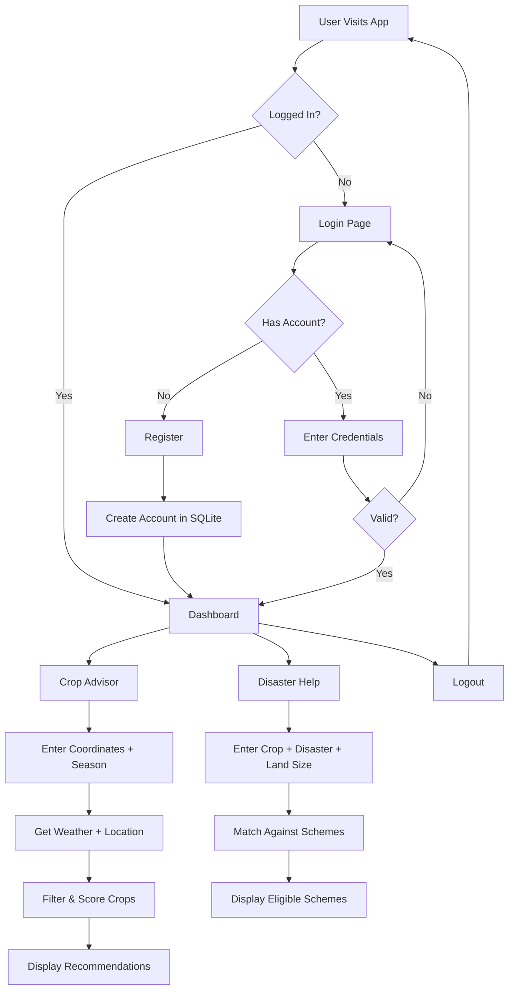
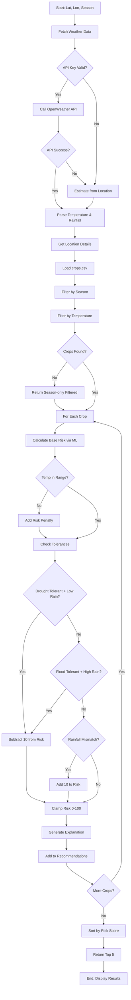
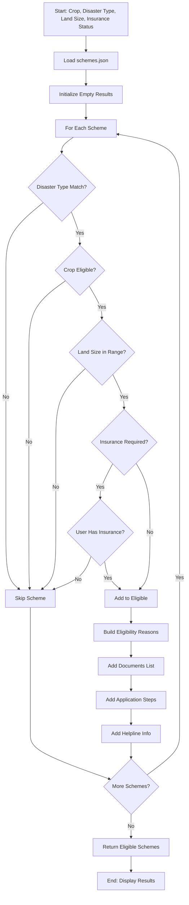
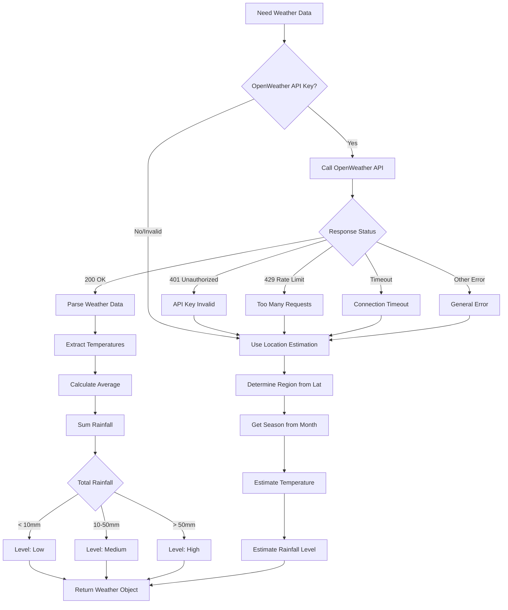
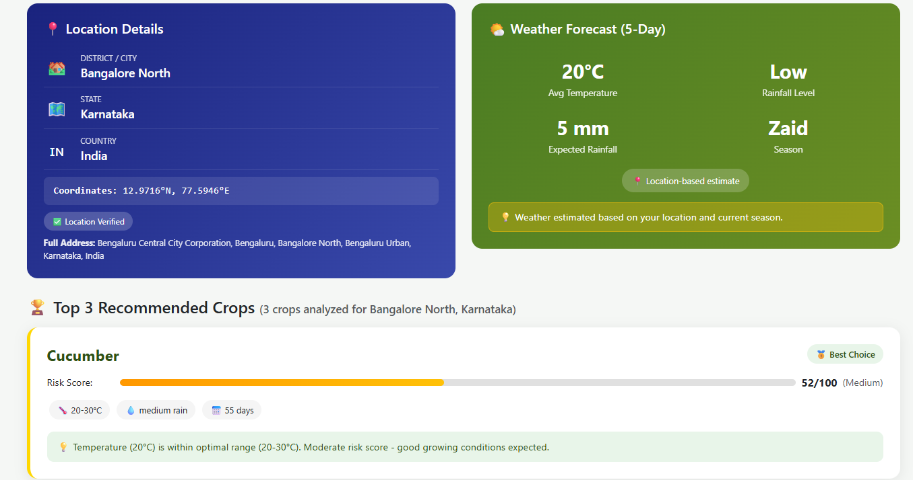
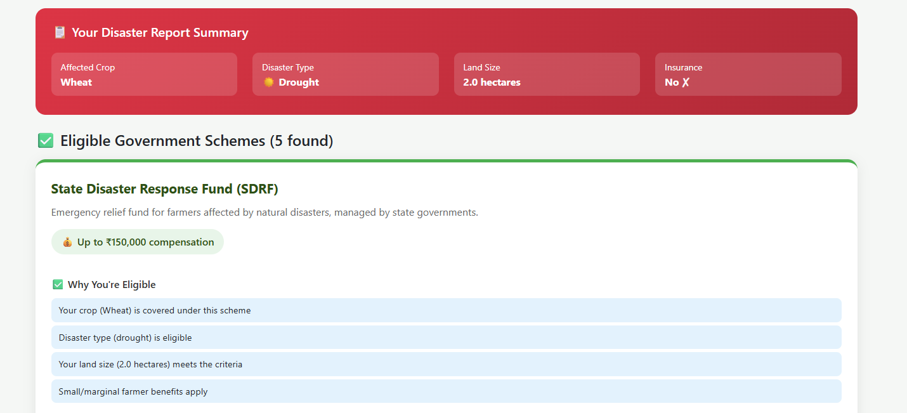

# 🌾 CropPilot

## Crop Advisor & Disaster Help Navigator

A comprehensive Flask web application designed to empower Indian farmers with intelligent crop recommendations based on weather conditions and a disaster relief scheme navigator to help them access government assistance during agricultural emergencies.


---

## 📋 Table of Contents

- [Problem Statement](#-problem-statement)
- [Features](#-features)
- [Tech Stack](#-tech-stack)
- [Project Structure](#-project-structure)
- [How It Works](#-how-it-works)
- [System Flowcharts](#-system-flowcharts)
- [Installation & Setup](#-installation--setup)
- [API Configuration](#-api-configuration)
- [Example Use Cases](#-example-use-cases)
- [Benefits](#-benefits)
- [Future Scope](#-future-scope)
- [Screenshots](#-screenshots)
- [License](#-license)

---

## 🎯 Problem Statement

Indian farmers face two critical challenges:

1. **Crop Selection Uncertainty**: Choosing the wrong crop for current weather conditions leads to crop failure, financial losses, and food insecurity. Farmers often rely on outdated traditional knowledge that doesn't account for changing climate patterns.

2. **Disaster Relief Access Gap**: When natural disasters strike (floods, droughts, cyclones), farmers struggle to identify which government schemes they're eligible for, what documents are required, and how to apply. This results in billions of rupees in unclaimed relief funds.

**Smart Farmer Assistant** bridges these gaps by providing:
- Real-time weather-based crop recommendations with risk assessment
- Instant disaster scheme eligibility checking with step-by-step application guidance

---

## ✨ Features

### 🔐 User Authentication System
- Secure farmer registration with phone number verification
- Password hashing using Werkzeug security
- Session-based authentication with login persistence
- State and district capture for localized recommendations

### 🌱 Intelligent Crop Advisory
- **Weather Integration**: Fetches 5-day forecast from OpenWeather API
- **Location Detection**: Reverse geocoding to identify district, state from coordinates
- **Risk Scoring**: ML-based risk assessment (0-100 scale) for each crop
- **Smart Filtering**: Crops filtered by season, temperature range, and rainfall needs
- **Tolerance Matching**: Recommends drought-tolerant crops in low rainfall, flood-tolerant in high rainfall
- **Detailed Explanations**: Why each crop is recommended with scientific reasoning

### 🆘 Disaster Scheme Navigator
- **Multi-Disaster Support**: Flood, drought, cyclone, hailstorm, pest attack coverage
- **Eligibility Engine**: Matches farmer profile against scheme requirements
- **Document Checklist**: Lists all required documents for each scheme
- **Step-by-Step Guidance**: Application process breakdown
- **Helpline Information**: Direct contact numbers and official websites

### 📱 Mobile-First Design
- Responsive Bootstrap 5 templates
- Touch-friendly interface for field use
- Works on low-bandwidth connections
- GPS coordinate input support

### 🧠 Rule-Based Decision Engine
- JSON-driven crop database with 15+ parameters per crop
- Comprehensive scheme database with eligibility criteria
- No ML training required for scheme matching - pure rule-based logic
- Easily extensible by editing JSON files

---

## 🛠 Tech Stack

| Component | Technology | Purpose |
|-----------|------------|---------|
| **Backend** | Flask 2.x | Web framework & routing |
| **Database** | SQLite | User data storage |
| **Authentication** | Werkzeug | Password hashing & sessions |
| **ML Model** | Scikit-learn | Risk prediction model |
| **Weather API** | OpenWeather | Real-time weather data |
| **Geocoding** | Nominatim (OSM) | Reverse geocoding |
| **Frontend** | Bootstrap 5 | Responsive UI |
| **Data Storage** | JSON | Crop & scheme databases |
| **Environment** | python-dotenv | Configuration management |

---

## 📁 Project Structure

```
crop_advisor/
│
├── app.py                    # Main Flask application (routes, logic)
├── model.py                  # ML model training & prediction
├── init_db.py               # Database initialization script
│
├── crops.csv                 # Crop database (name, temp range, rainfall, tolerances)
├── crop_data.json           # Extended crop info (seasons, growing days)
├── schemes.json             # Government schemes database
│
├── model.pkl                # Trained ML model (auto-generated)
├── rainfall_encoder.pkl     # Label encoder for rainfall levels
├── season_encoder.pkl       # Label encoder for seasons
│
├── farmers.db               # SQLite database (auto-generated)
├── .env                     # Environment variables (API keys)
├── requirements.txt         # Python dependencies
│
├── templates/
│   ├── login.html           # User login page
│   ├── register.html        # New user registration
│   ├── dashboard.html       # Main dashboard after login
│   ├── crop_form.html       # Crop advisory input form
│   ├── crop_result.html     # Crop recommendations display
│   ├── disaster_form.html   # Disaster help input form
│   └── disaster_result.html # Eligible schemes display
│
└── static/                  # CSS, JS, images (if any)
```

---

## ⚙ How It Works

### 1. User Authentication Flow

When a farmer registers, the system:
1. Validates phone number (10 digits) and password strength
2. Hashes password using `werkzeug.security.generate_password_hash()`
3. Stores user in SQLite with state/district for localization
4. Auto-logs in user and creates session

```python
# Password is never stored in plain text
password_hash = generate_password_hash(password)
cursor.execute('INSERT INTO users (...) VALUES (...)', (name, phone, password_hash, state, district))
```

### 2. Crop Recommendation Engine

The recommendation process follows this logic:

```
Input: Latitude, Longitude, Season
                ↓
        Fetch Weather Data
    (OpenWeather API / Fallback)
                ↓
      Get Location Details
   (Nominatim / Estimated)
                ↓
    Filter Crops by Season
                ↓
   Filter by Temperature Range
    (±5°C tolerance applied)
                ↓
    Calculate Risk Score for Each
   (ML model + adjustments)
                ↓
   Sort by Risk (lowest first)
                ↓
    Return Top 5 Recommendations
```

**Risk Score Calculation:**
```python
base_risk = predict_risk(model, temp, rainfall_level, season)  # ML prediction

# Adjustments based on crop characteristics
if temp outside crop's optimal range:
    adjusted_risk += temp_difference * 2 (max 20)

if low_rainfall AND crop.drought_tolerant:
    adjusted_risk -= 10  # Bonus for matching tolerance

if rainfall_level != crop.rainfall_need:
    adjusted_risk += 10  # Penalty for mismatch
```

### 3. Disaster Scheme Matching

The scheme eligibility engine uses rule-based matching:

```python
for scheme in schemes_database:
    if disaster_type NOT in scheme.disaster_types:
        SKIP
    if crop NOT in scheme.eligible_crops:
        SKIP
    if land_size NOT in scheme.size_range:
        SKIP
    if scheme.requires_insurance AND NOT has_insurance:
        SKIP
    
    # All checks passed - scheme is eligible
    eligible_schemes.append(scheme)
```

### 4. Weather Data Pipeline

```
Primary: OpenWeather API (if key configured)
    ↓ (on failure)
Fallback: Location-based Estimation
    - Temperature estimated from latitude + current month
    - Rainfall estimated from season + coastal proximity
```

### 5. Location Detection Pipeline

```
Method 1: OpenWeather Geocoding API
    ↓ (on failure)
Method 2: Nominatim (OpenStreetMap) - Free
    ↓ (on failure)
Method 3: Coordinate-based State Estimation
    - Uses lat/lon ranges to estimate Indian state
```

---

## 📊 System Flowcharts

### Overall Application Flow



### Crop Advisory Logic Flow



### Disaster Scheme Matching Flow



### Weather Data Decision Tree



---

## 🚀 Installation & Setup

### Prerequisites
- Python 3.8 or higher
- pip (Python package manager)
- Git (optional)

### Step 1: Clone or Download the Project

```bash
git clone https://github.com/yourusername/crop_advisor.git
cd crop_advisor
```

Or download and extract the ZIP file.

### Step 2: Create Virtual Environment (Recommended)

```bash
# Windows
python -m venv venv
venv\Scripts\activate

# Linux/Mac
python3 -m venv venv
source venv/bin/activate
```

### Step 3: Install Dependencies

```bash
pip install -r requirements.txt
```

If `requirements.txt` doesn't exist, install manually:

```bash
pip install flask pandas scikit-learn requests python-dotenv werkzeug
```

### Step 4: Configure Environment Variables

Create a `.env` file in the project root:

```env
SECRET_KEY=your-super-secret-key-change-this
OPENWEATHER_API_KEY=your_openweather_api_key_here
```

### Step 5: Initialize the Database

```bash
python init_db.py
```

Or the database will auto-initialize on first run.

### Step 6: Run the Application

```bash
python app.py
```

### Step 7: Access the Application

Open your browser and navigate to:

```
http://127.0.0.1:5000
```

---

## 🔑 API Configuration

### OpenWeather API (Optional but Recommended)

1. Visit [OpenWeatherMap](https://openweathermap.org/api)
2. Create a free account
3. Navigate to "API Keys" section
4. Copy your API key
5. Add to `.env` file:
   ```env
   OPENWEATHER_API_KEY=a1b2c3d4e5f6g7h8i9j0k1l2m3n4o5p6
   ```
6. Wait 10-15 minutes for key activation
7. Restart the Flask app

**Without API Key**: The app will still work using location-based weather estimation based on latitude, current month, and regional climate patterns.

### Testing API Status

After login, visit:
```
http://127.0.0.1:5000/api-status
```

This returns JSON showing API configuration status and test weather data.

---

## 📖 Example Use Cases

### Use Case 1: Pre-Season Crop Planning

**Scenario**: Ramesh, a farmer in Nashik, Maharashtra wants to know what to plant for Kharif season.

**Steps**:
1. Ramesh logs into the app
2. Goes to "Crop Advisor"
3. Enters coordinates: `19.9975° N, 73.7898° E`
4. Selects season: `Kharif`
5. Submits the form

**System Response**:
```
📍 Location: Nashik, Maharashtra, India
🌤️ Weather: 28.5°C, Medium Rainfall Expected

🏆 Top Recommendations:

1. 🥇 Rice (Risk: 15/100)
   ✓ Temperature optimal (20-35°C)
   ✓ Rainfall matches requirement
   ✓ Flood-tolerant variety available

2. 🥈 Cotton (Risk: 22/100)
   ✓ Temperature suitable
   ✓ Drought-tolerant if rainfall drops

3. 🥉 Soybean (Risk: 28/100)
   ✓ Good for medium rainfall
   ✓ 90-day growing period fits season
```

### Use Case 2: Post-Disaster Relief Access

**Scenario**: After severe flooding in Bihar, Sunita needs to find relief schemes for her damaged wheat crop.

**Before Smart Farmer Assistant**:
- Sunita would visit multiple government offices
- Spend days figuring out which schemes apply
- Miss deadlines due to lack of information
- Potentially lose eligible relief funds

**With Smart Farmer Assistant**:

1. Sunita logs in and selects "Disaster Help"
2. Enters:
   - Crop: `Wheat`
   - Disaster: `Flood`
   - Land Size: `1.5 hectares`
   - Has Insurance: `Yes`

**System Response**:
```
🆘 Eligible Schemes for Flood Damage (Wheat):

1. Pradhan Mantri Fasal Bima Yojana (PMFBY)
   💰 Max Amount: ₹2,00,000
   
   📋 Required Documents:
   - Aadhaar Card
   - Land Records (7/12 or Khasra)
   - Bank Passbook
   - Crop Sowing Certificate
   - Insurance Policy Copy
   
   📝 Application Steps:
   1. Report loss within 72 hours to insurance company
   2. Fill claim form at nearest bank/CSC
   3. Submit photographs of damage
   4. Await field verification
   
   📞 Helpline: 1800-XXX-XXXX
   🌐 Website: pmfby.gov.in

2. State Disaster Relief Fund (SDRF)
   💰 Max Amount: ₹33,000/hectare
   ...
```

---

## 💡 Benefits

### For Farmers

| Benefit | Description |
|---------|-------------|
| **Reduced Crop Failure** | Weather-aware recommendations minimize risk |
| **Time Savings** | Instant scheme eligibility vs. days of office visits |
| **Informed Decisions** | Scientific explanations, not just suggestions |
| **Document Readiness** | Know what papers to prepare before applying |
| **Multilingual Potential** | Easy to extend for regional languages |

### For Agricultural Extension Workers

| Benefit | Description |
|---------|-------------|
| **Consistent Advice** | Same scientific basis for all recommendations |
| **Scalability** | One tool serves thousands of farmers |
| **Data-Driven** | Recommendations based on actual weather data |
| **Easy Updates** | Add new schemes by editing JSON files |

### For Government

| Benefit | Description |
|---------|-------------|
| **Increased Scheme Uptake** | More farmers aware of available relief |
| **Reduced Administrative Load** | Farmers come prepared with correct documents |
| **Better Targeting** | Ensure relief reaches eligible beneficiaries |

---

## 🔮 Future Scope

### Short-Term Enhancements

1. **Regional Language Support**
   - Hindi, Tamil, Telugu, Marathi translations
   - Voice input for coordinates

2. **SMS Integration**
   - Send recommendations via SMS for low-internet areas
   - Disaster alerts to registered farmers

3. **Offline Mode**
   - Cache crop data locally
   - Sync when connectivity returns

### Medium-Term Features

4. **Soil Type Integration**
   - Add soil data from government databases
   - Refine recommendations based on soil health

5. **Market Price Integration**
   - Show current mandi prices for recommended crops
   - Profit potential estimation

6. **Community Features**
   - Local farmer chat groups
   - Success story sharing

### Long-Term Vision

7. **AI Crop Doctor**
   - Image-based pest/disease identification
   - Treatment recommendations

8. **Yield Prediction**
   - Historical data analysis
   - Expected harvest quantity estimation

9. **Government Portal Integration**
   - Direct scheme application submission
   - Application status tracking

10. **IoT Sensor Integration**
    - Connect soil moisture sensors
    - Real-time field monitoring

---

## 📸 Screenshots

## 📸 Screenshots

### 🔐 Login Page


### 🧭 Dashboard


### 🌱 Crop Advisory Result


### 🌪️ Disaster Scheme Result



---

## 📄 License

This project is licensed under the MIT License - see below for details:

```
MIT License

Copyright (c) 2024 Smart Farmer Assistant

Permission is hereby granted, free of charge, to any person obtaining a copy
of this software and associated documentation files (the "Software"), to deal
in the Software without restriction, including without limitation the rights
to use, copy, modify, merge, publish, distribute, sublicense, and/or sell
copies of the Software, and to permit persons to whom the Software is
furnished to do so, subject to the following conditions:

The above copyright notice and this permission notice shall be included in all
copies or substantial portions of the Software.

THE SOFTWARE IS PROVIDED "AS IS", WITHOUT WARRANTY OF ANY KIND, EXPRESS OR
IMPLIED, INCLUDING BUT NOT LIMITED TO THE WARRANTIES OF MERCHANTABILITY,
FITNESS FOR A PARTICULAR PURPOSE AND NONINFRINGEMENT. IN NO EVENT SHALL THE
AUTHORS OR COPYRIGHT HOLDERS BE LIABLE FOR ANY CLAIM, DAMAGES OR OTHER
LIABILITY, WHETHER IN AN ACTION OF CONTRACT, TORT OR OTHERWISE, ARISING FROM,
OUT OF OR IN CONNECTION WITH THE SOFTWARE OR THE USE OR OTHER DEALINGS IN THE
SOFTWARE.
```

---

## 🤝 Contributing

Contributions are welcome! Please feel free to submit a Pull Request.

1. Fork the repository
2. Create your feature branch (`git checkout -b feature/AmazingFeature`)
3. Commit your changes (`git commit -m 'Add some AmazingFeature'`)
4. Push to the branch (`git push origin feature/AmazingFeature`)
5. Open a Pull Request

---

## 📞 Support

For support, please:
- Open an issue on GitHub
- Contact the development team

---

<div align="center">

**Made with ❤️ for Indian Farmers**

🌾 *Empowering Agriculture Through Technology* 🌾

</div>
